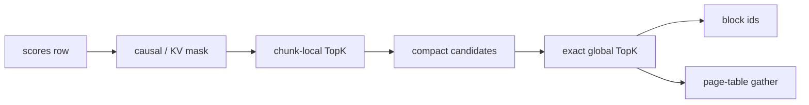

# Task 02：DSA TopK Page Table Transform

> **报告信息**：FlagOS KernelGen 72H 上海站 · 最终榜单截至 2026-07-20 12:00（UTC+8） · 对应实现见 [`src/task02_dsa_topk_page_table_transform.py`](../src/task02_dsa_topk_page_table_transform.py)

## 最终效果

**最终官方成绩：4.24x，rank 5，六个平台全部通过。**

| 海光 | 沐曦 | 昇腾 | NVIDIA | 平头哥 | 天数智芯 | 几何平均 |
|---:|---:|---:|---:|---:|---:|---:|
| 7.05x | 5.62x | 0.28x | 7.02x | 7.53x | 10.05x | **4.24x** |

> 各平台分数按榜单界面显示到两位小数；4.24x 直接采用官方 `avgSpeedup` 字段。由表中已舍入分项重新计算会得到约 4.25x，因此不应使用显示值反推官方总分。

### 技术摘要

- 这不是 GEMM：主成本是 compare/select、shuffle、候选队列、寄存器/UB 和不规则 page gather，TFLOPS 不能解释性能。
- 总体结构是**有效区裁剪 → 分块局部 TopK → 小候选精排 → page gather**；小形状使用 row-resident 单 kernel，大形状按后端选择 packed、radix 或静态分区。
- 正确性核心是统一的 `(score desc, block_id asc)` 顺序。所有阈值或分布特化都必须带容量保护、精确重载和 fallback。

---

## 1. 题目拆解：TopK 只是中间步骤，最终还要做页表转换

输入 `scores[B,H,Q,NB]`。每个 query row 先根据 `q_pos`、`kv_lens` 和 `block_size` 得到 causal 有效前缀，再选择前 `K` 个 block：

```text
valid(block) = block 在 query 的 causal 范围和有效 KV 范围内
order        = score 降序；score 相同时 block_id 升序
out_blocks   = selected block_id
out_pages    = page_table[selected block_id]
```

令 `R=B·H·Q`、`N=NB`、`K=top_k`。算法不允许只返回无序集合；确定性 tie-break 和 page-table gather 都是接口语义的一部分。

**图 1　从有效前缀到精确页表输出的分层选择数据流**



---

## 2. 总体方案：先缩候选，再做精确排序

完整排序 `N` 个元素远高于 TopK 的必要工作。最终方案按规模分为三层：

| 规模 | 数据流 | 目的 |
|---|---|---|
| `N≤512` 或部分 `N=1024` | row-resident 单 kernel | 零 scratch、一次 launch |
| `N=1024/2048` | 512/1024 chunk-local TopK + merge | 把全局候选缩到 `chunks×K` |
| `N=4096,K=128` | 芯片专用 radix/分区/packed 路径 | 删除四个宽 TopK 和冗余 score 读取 |

候选缩减保持精确的充分条件是：每个 chunk 至少保留其局部前 `K`。一个被某 chunk 局部前 `K` 淘汰的元素，在全局也不可能进入前 `K`，因为同一 chunk 内已经存在至少 `K` 个不劣于它的元素。

---

## 3. 瓶颈分析：排序网络而不是 FMA 峰值

最坏全 valid 行的语义最低流量为：

```text
bytes_min ≈ R · (d·N + 12K)
```

其中 `d∈{2,4}` 是 BF16/FP32 score 字节数，`12K` 包含两个 int32 输出和 page gather。最大 FP32 workload `(R,N,K)=(32768,4096,128)` 的最低流量为 **560 MiB**。

但流量不是唯一成本。完整 bitonic 网络的比较对数量为：

```text
S(n) = n · log2(n) · (log2(n)+1) / 4
```

| n | bitonic comparator pairs |
|---:|---:|
| 512 | 11,520 |
| 1024 | 28,160 |
| 2048 | 67,584 |
| 4096 | 159,744 |

Ascend `N=4096` 的历史 prefix31 路径，8 个 `sort512`、7 次 merge、`sort256` 和最终 rank 扫描合计约 **210k comparator/shuffle proxy/row**。这远比少量页表读取昂贵，且会放大为 UB 临时状态和长依赖链。

一个关键反例是 packed-u64：它删除最终 score 重载，却把最大 workload 的估算总流量从 944 MiB 增至 1072 MiB，NVIDIA 分项从 5.74x 降到约 5.50x。**减少比较但扩大 scratch，不一定更快。**

---

## 4. 为什么必须做芯片专用分支

| 平台特征 | 主要矛盾 | 最终策略 |
|---|---|---|
| A100，warp32，shared memory 强 | score 重读与宽选择网络并存 | 单读 shared-radix、固定容量 guard |
| 真武 810E，warp32，高 HBM 带宽 | 单 CTA 串行四 chunk 会丢并行度 | 保留 chunk 级并行和固定 fan-in |
| C550，104 CU，wave64 | compare/select 与 occupancy 高于纯带宽压力 | 静态分区 compact + 小候选精排 |
| BW/gfx936，80 CU | packed key 与后端 TopK lowering | u64/ID scratch 专线 |
| BI-V150，16 CU，wave64 | 巨型 tile 占用过高，小任务 launch 昂贵 | 小形状 row-resident；大形状固定局部选择 |
| Ascend 910B4，Vector/UB | native sort、UB 对齐与动态 scatter | builder `vsort`、静态 worker、精确重载 |

跨后端共享的是比较语义和候选正确性证明，不共享的是 scratch 表示、tile、worker 数和 merge 拓扑。

---

## 5. 核心技术一：把 score 和 id 编成确定性排序键

TopK 必须满足：

```text
score_a > score_b  => a 在前
score_a = score_b  => id_a < id_b 时 a 在前
```

实现先把浮点数映射为保持数值顺序的整数 key，再把反向编码的 block id 放入低位：

```text
packed_key = ordered_score_bits || reversed_block_id
```

这样一次 compare-and-swap 同时完成 score 比较和 tie-break，不需要维护两套交换网络。中间队列可以只保存紧凑 key 或候选 id；最终阶段重载原始 score 做精确排序，避免 BF16/截断 key 改变答案。

这个设计还有两个工程收益：

- compare/select 的每次交换只移动一个逻辑对象；
- 相同顺序定义贯穿局部 TopK、候选 merge 和最终 gather，减少后端间正确性分叉。

---

## 6. 核心技术二：分块局部 TopK 与小候选精排

对 `N=4096,K=128`，若按 1024 切成 4 块：

```text
4096 scores
  -> 4 × local Top128
  -> 512 candidates
  -> exact Top128
```

相较完整 `sort4096`，它把最终网络从 4096 元素缩到 512 元素，并让四个局部任务并行执行。候选阶段只写 id 时，scratch 为：

```text
R · 4 chunks · 128 ids · 4 bytes
```

精确 merge 再读取候选对应的原 score。是否把 score 一起打包，取决于“少一次随机重载”和“scratch 翻倍”之间的后端权衡；A100 的官方 A/B 已证明 int32 id scratch 更合适。

---

## 7. 核心技术三：有保护的阈值/分区快路径

固定 workload 的 FP32 score 具有稳定分布。大形状先通过 radix 或固定阈值把候选压缩到小容量，再做精确选择：

```text
score scan
  -> threshold / radix bucket
  -> compact candidates
  -> capacity check
  -> exact reload + sort
  -> fallback when overflow
```

正确性不依赖“分布大概率如此”，而依赖三道保护：

1. compact 数量不得超过静态容量；
2. 候选必须覆盖第 K 名所在 bucket；
3. guard 不成立时回退到完整精确路径。

A100 的单读 shared-radix 把最大 workload 的正常 GM 流量压到约 **560.4 MiB**，接近 560 MiB 语义下界；官方 NVIDIA 分项由 5.74x 提升到 6.07x（约 +5.7%）。MetaX 即使多读约 11% score，删除四个宽 `TopK(1024,128)` 后仍从 4.37x 提升到 4.66x，证明 C550 首先是 selection/occupancy 受限。

---

## 8. 核心技术四：Ascend packed28 / prefix31 精确选择

910B4 不能直接复用 GPGPU 的动态 histogram/scatter：动态 VEC gather 和未对齐 UB 地址会触发运行时错误。最终使用两条静态路径：

### BF16：packed28 + builder `vsort`

- score 与 id 压成静态宽度 key；
- 固定 worker 处理连续前缀；
- 使用后端 native builder sort；
- merge 后直接 decode page。

### FP32：prefix31 候选 + 精确重载

- 先用高位前缀筛选候选；
- 候选 id 使用固定槽和静态容量；
- 重载原始 FP32 score；
- 执行精确排序与 deterministic tie-break。

这条路径保证六平台正确性，但最终昇腾只有 0.28x。把候选宽度从 `2K` 降到 `K+32` 后仍约 0.26x，说明 decoder 不是主因；真正瓶颈仍是首阶段反复 native sort/merge 与 UB 数据交换。这个负结果直接限定了后续方向：必须降低选择复杂度，而不是继续微调候选尾部。

---

## 9. 其他有效优化汇总

| 优化 | 具体作用 |
|---|---|
| row-resident 小形状内核 | mask、TopK 和 page gather 一次完成，零 scratch |
| int16/int32 候选 id | 在范围安全时缩窄中间队列 |
| causal bound 预计算 | 避免每个 chunk 重复计算有效上界 |
| merge 与 page gather 融合 | 最终候选确定后立即写两个输出 |
| tuple 专用 owner | 只在 `B/H/Q/block_size` 真正改变局部性或并行度时分支 |
| 静态 grid / worker | 避免 Ascend 动态 launch、UB scatter 和地址不对齐 |
| backend-specific chunk | A100 512，wave64 后端常用 1024，兼顾并行和状态 |

被证伪的路线包括：全行 histogram、rank-scatter、超宽 vector TopK、单 CTA 串行四块，以及只复制 workload 判断却不改变数据流的“伪专用化”。

---

## 10. 最终成绩再次确认

```text
Hygon 7.05x   MetaX 5.62x   Ascend 0.28x
NVIDIA 7.02x T-Head 7.53x  TianShu 10.05x
Geomean 4.24x · Rank 5 · 6/6
```

五个 GPGPU 后端已经验证“局部选择 + 小候选精排 + 页表融合”的有效性；最终总分的主要短板是 Ascend 首阶段选择网络，而不是 decoder 或 page gather。

---

## 11. 参赛复盘

1. **TopK 不能用 TFLOPS 建模。** compare、shuffle、UB 和 scratch 才是稀缺资源，必须同时记录选择代理量和字节数。
2. **精确语义要先统一。** score/id tie-break 一旦在不同 kernel 中不一致，优化越复杂越难排查。
3. **减少计算与减少流量可能冲突。** packed-u64、GM funnel 和单 CTA 串行都曾在一个维度变好、墙钟性能却下降。
4. **固定分布可以利用，但 guard 必须构成算法的一部分。** 没有容量检查和精确 fallback 的阈值优化不可发布。
5. **Ascend 要从 lowering 约束反推结构。** 动态 scatter、未对齐 UB 和大 CUDA 式 grid 不是参数问题，需要换成静态槽与固定 worker。
6. **代码体积也是比赛资源。** 多后端专线必须清理废弃 kernel，持续控制单文件大小，同时保持一个可回滚的 6/6 主线。

---
