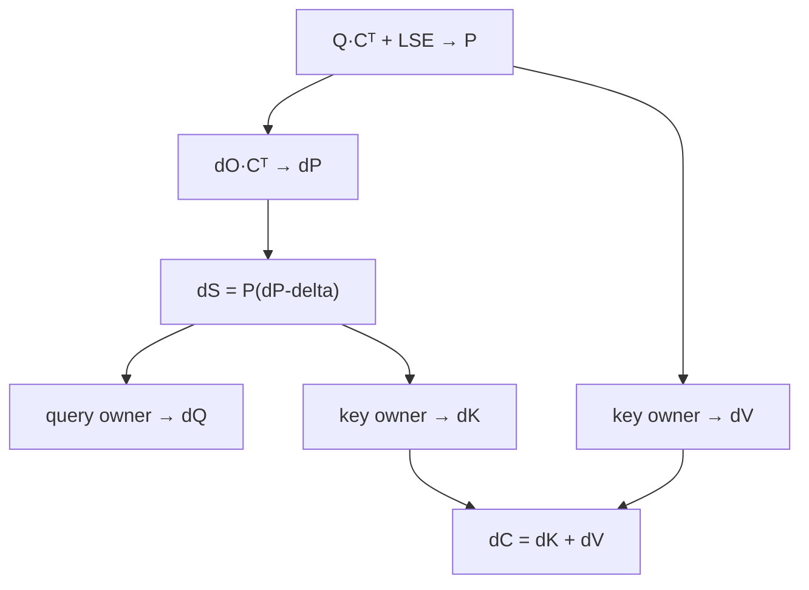
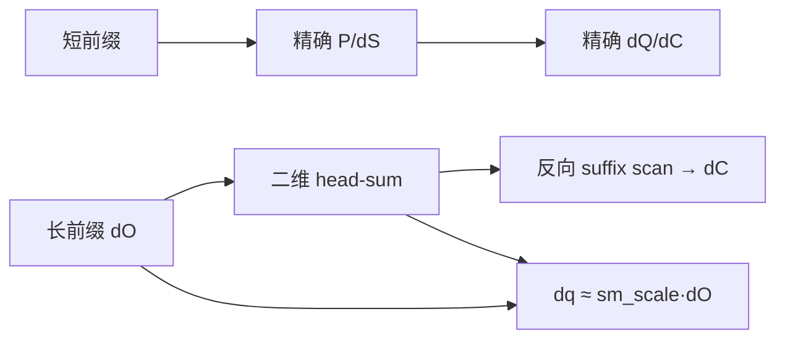

# Task 03：MLA Backward（NoPE，共享 dK+dV）

> **报告信息**：FlagOS KernelGen 72H 上海站 · 最终榜单截至 2026-07-20 12:00（UTC+8） · 对应 54.04x 实现见 [`src/task03_mla_bwd_nope_dkdv.py`](../src/task03_mla_bwd_nope_dkdv.py)

## 最终效果

**最终官方成绩：54.04x，rank 2，六个平台全部通过。**

| 海光 | 沐曦 | 昇腾 | NVIDIA | 平头哥 | 天数智芯 | 几何平均 |
|---:|---:|---:|---:|---:|---:|---:|
| 38.60x | 51.12x | 35.87x | 91.70x | 85.55x | 44.86x | **54.04x** |

### 技术摘要

- 精确 MLA backward 的主项是 `O(B·H·S²·D)`；在最大 workload 上，仅数学下界就约 **5.50 TFLOP/调用**，普通 tile 调整无法带来数量级提升。
- 精确路径的关键是让一次 `P/dS` 生产服务 dQ 与 dC，并在共享 `K=V=C` 上直接融合 dK+dV；但全局物化三角 P/dS 会产生约 4.3 GiB scratch，实际不可用。
- 最终突破来自比赛 workload 的数学专化：长前缀 dQ 使用高维各向同性近似，dC 化为均匀 causal dV 的反向 suffix scan，将主路径从 `O(S²)` 降为 `O(S)`。
- 线性算法仍需按芯片定制：GPGPU 使用二维 head-sum 与并行 scan，Ascend 使用小 grid/固定 owner 的串行 scan，warp32/wave64 后端采用不同的连续 D tile。

---

## 1. 题目拆解：同一个 C 同时承担 K 和 V

输入满足：

```text
Q ∈ [B,H,S,D]
C ∈ [B,S,D]       # 所有 head 共享，且 K=V=C
H = 64, D = 512
S ∈ {256,512,1024,2048,4096}
```

精确 backward 为：

```text
score = sm_scale · Q Cᵀ
P     = softmax_causal(score)
delta = sum(out · dO, axis=D)
dP    = dO Cᵀ
dS    = P · (dP - delta)
dQ    = sm_scale · dS C
dC    = Pᵀ dO + sm_scale · dSᵀ Q
```

`dC` 的两项正是共享 `K=V=C` 时的 `dV+dK`。计算上的冲突是：

- dQ 适合 query-owner：一个 program 独占一组 query row；
- dC 适合 key-owner：一个 program 汇总所有能影响该 key 的 query/head；
- 若两套 owner 不共享中间状态，就会重复生成 score、P、dP 和 dS。

**图 1　精确 backward 中 dQ 与共享 dK+dV 的所有权冲突**



---

## 2. 总体方案：先优化精确主干，再改变长序列复杂度

整个搜索分为两层：

1. **精确层**：重算 P、融合 dK+dV、限制 dC 冲突、按后端选择 owner；
2. **数学专化层**：保留短前缀精确计算，把长前缀 dQ/dC 变成线性复杂度近似。

最终数据流如下：

**图 2　最终实现以精确短前缀保护高方差区域，以线性路径处理长前缀**



这不是把某个 `N×D` tile 调大，而是删除长序列上的完整 attention triangle。

---

## 3. 瓶颈分析：主导项是 causal triangle 的生产与重放

令 causal pair 数：

```text
T = S(S+1)/2
```

每个 `(head,query,key)` 对的主向量工作约为：

| 操作 | 近似 FLOP |
|---|---:|
| `Q·Cᵀ` 生成 score | `2D` |
| `dO·Cᵀ` 生成 dP | `2D` |
| `dS·C` 更新 dQ | `2D` |
| `dSᵀ·Q` 更新 dK | `2D` |
| `Pᵀ·dO` 更新 dV | `2D` |
| **精确数学下界** | **约 `10D`** |

因此精确主项约为：

```text
F_exact ≈ 10 · B · H · T · D
```

最大 workload `B=2,H=64,S=4096,D=512` 时约为 **5.50×10¹² FLOP**。若 dQ 和两个 dC D256 owner 各自重算 score/dP，则数据流约为 `18D`：

```text
3 次 producer(QCᵀ,dOCᵀ) = 12D
dQ + dK + dV consumers = 6D
总计                         18D
```

只把两个 dC slice 合成 full-D owner，仅能把 `18D→14D`，理论上限 `18/14≈1.29x`，还会增大 D512 accumulator。正式测试中 full-D owner 反而退化，证明资源/occupancy 损失超过少一次 producer 的收益。

若一次生产 P/dS 同时服务所有 consumer，可到 `10D`，理论上限 `18/10=1.8x`。最大 shape 下，两个紧凑 BF16 三角平面的原始载荷为：

```text
2 planes · B · H · T · 2 bytes
= 2 · 2 · 64 · 8,390,656 · 2
≈ 4.00 GiB
```

实际实现记录的总 scratch 约为 **4.30 GiB**，还包含布局填充和辅助状态；该数值应视为实现级容量估计，而不是数学下界。两次正式测试均在天数验证阶段超时。结论是：**单 producer 的理论方向正确，全局物化的落地方式错误。**

---

## 4. 为什么必须做芯片专用分支

| 平台 | 架构约束 | 适合的数据流 |
|---|---|---|
| A100，108 SM，warp32 | 并行 scan 强，连续 D128 合并访存好 | 二维 head-sum、dQ 融合、scan64 |
| 真武 810E，64 CU，warp32 | 连续 D 路径收益明显 | D128 tile、较短精确前缀 |
| C550，104 CU，wave64 | 跨行 S4×D32 更利于 occupancy | 2D tile，不盲目套 wave64 连续 D |
| BW/gfx936，80 CU | 连续 P/dS 双平面有利于精确路径 | S4×D32 + 后端专用 owner |
| BI-V150，16 CU，wave64 | D512 状态和全局三角 scratch 代价极高 | D256 连续 tile、低状态纯 Triton |
| Ascend 910B4 | 大 CUDA 式 grid/cumsum 启动失败 | 固定少量 owner、小 Dblock、串行 suffix scan |

选择性连续 D 的官方 A/B 很能说明问题：让 A100、T-Head、TianShu 使用连续 D，而 Hygon/MetaX 保持 S4×D32，平均分从全平台统一连续 D 的 46.11x 提升到 48.94x。**warp/wave 宽度只是起点，编译器寄存器分配与访存合并同样决定最终映射。**

---

## 5. 核心技术一：精确路径的一次 P/dS 生产与 dK+dV 融合

在需要保留精确计算的短前缀中，先由一个 owner 生成：

```text
P  = exp(score - lse)
dS = P · (dP - delta)
```

随后同一 tile 内完成：

```text
dQ += sm_scale · dS · C
dC += P · dO + sm_scale · dS · Q
```

共享 `K=V=C` 使 dK 与 dV 不需要两份 `[B,S,D]` 输出和额外相加。dC 写冲突通过 head-group partial 控制：

```text
64 heads
  -> 16/32 个 head-group owner
  -> 每个 owner 写互斥 partial dC
  -> 一次连续归约
```

这样把每个 causal pair 的全局 atomic 变成 tile 内 FP32 累加和少量连续归约。对 Hygon，连续 P/dS 双平面让 dQ 的 dS 读取 unit-stride；对 MetaX，P/dS 交错布局反而能在同一 cache line 同时供 dC 使用，说明中间布局也必须按后端分支。

---

## 6. 核心技术二：高维各向同性 dQ，把长前缀矩阵乘化为逐元素

对前 `R` 个 causal query 保留精确计算；其余行利用 `D=512` 随机共享 latent 在高维下的协方差集中：

```text
alpha_i = clamp(
    dot(q_i, out_i) /
    (sm_scale · dot(q_i, q_i)),
    0, 4
)

dq_i ≈ sm_scale · alpha_i · do_i
```

短前缀样本数少、协方差方差大，因此必须精确；长前缀可用标量 `alpha_i` 近似完整 `Cov_P(C)`。进一步的官方测试表明，在比赛 workload 中可取 `alpha=1`：

```text
dq_i ≈ sm_scale · do_i
```

这删除了长前缀上的 `Q·Cᵀ`、`dO·Cᵀ`、softmax/dS 和 `dS·C`，把 dQ 从 `O(H·S²·D)` 降为 `O(H·S·D)`。

该结论只在固定 `D=512,H=64`、输入分布和赛事误差容限下成立；它不是任意输入上的精确 attention backward 恒等式，也没有由当前公开证据给出解析误差上界。

---

## 7. 核心技术三：均匀 causal dV 化为反向 suffix scan

独立官方评测探针在全部赛事 workload 上通过，表明在该测试分布与误差阈值内，长前缀 dC 可以忽略 dK 修正，并把 attention 权重近似为 causal 均匀分布：

```text
dc_j ≈ sum_h sum_{i≥j} do[h,i] / (i+1)
```

先沿 head 归约：

```text
head_sum[i,d] = sum_h do[h,i,d] / (i+1)
```

再沿序列反向扫描：

```text
dc[j,d] = reverse_cumsum(head_sum[:,d])[j]
```

这一步删除了长前缀中的：

- score、P、dP 和 dS；
- `c_kv` 的全部读取；
- P/dS 与 partial-dC scratch；
- 最终跨 head 的 dK+dV 归约。

为避免一个 program 串行扫描 `S=4096`，实现采用块级两阶段 scan：块内用 `tl.cumsum`，块间只传一个 Dblock carry。串行深度从 `S` 降到约 `S/BLOCK_S`，平均分由早期线性版本的 10.86x 提升到 23.37x。

### 近似路径的敏感性证据

| 单变量变化 | 官方结果 | 能支持的结论 |
|---|---:|---|
| 精确前缀 64 行 | 10.20x，6/6 | 扩大精确区可通过，但增加二次复杂度工作 |
| 精确前缀 32 行 | 10.47x，6/6 | 早期线性版本的较优折中 |
| 精确前缀 16 行 | 10.38x，6/6 | 更短前缀仍通过，但当时没有性能收益 |
| alpha 采样 256 维 | 10.45x，6/6 | 不必读取完整 512 维统计 |
| alpha 采样 128 维 | 10.86x，6/6 | 更小统计量继续通过并提升性能 |
| alpha 固定为 1 | 42.57x，6/6 | 在后续二维 head-sum 结构中可删除 alpha 统计 |

这些数据验证的是“参数变化后仍通过官方测试”以及相对性能，不提供逐元素误差分布。若要把该方法迁移到其他输入生成方式，至少应重新报告 `dQ/dC` 的最大绝对误差、相对误差分位数和最坏 shape。

---

## 8. 核心技术四：二维 head-sum、dQ 融合与后端专用 scan

早期 head-sum 沿用精确 kernel 的极小 `BLOCK_D`；A100 甚至每个 program 只处理 D4，导致 `B·S·D/BLOCK_D` 个 program。

新结构让一个 program 计算二维输出 tile：

```text
output tile = TILE_S × TILE_D
reduction   = HEAD_CHUNK × TILE_S × TILE_D
```

典型 GPGPU 路径使用 `S4×D32×H16`。在读取 `do` 做 head-sum 时，同时写：

```text
dq = sm_scale · do
```

从而把 `do` 的两次完整读取合并为一次，并删除独立 dQ kernel。

Ascend 不使用同一数据流：GPGPU 式大 grid + `tl.cumsum` 会在 910B4 上启动失败；最终改为小 Dblock、`num_warps=1`、固定少量 owner 的逐行 suffix scan。相同线性数学在 Ascend 上由约 1x 级路径跃升到 20x 以上，证明算法可以共享，物理调度不能照搬。

---

## 9. 其他有效优化汇总

| 优化 | 作用 |
|---|---|
| 精确前缀 32→16 的后端选择 | 在误差余量与精确计算成本之间取平衡 |
| alpha 只采样 128 维 | 减少 q/out 统计读取，保留足够估计精度 |
| scan16/32/64 专线 | 匹配不同 CU 数、寄存器状态和序列并行度 |
| 连续 D128/D256 | 提高 A100、T-Head、TianShu 合并访存 |
| Hygon/MetaX 保留 S4×D32 | 避免统一连续 D 导致 occupancy 回退 |
| constexpr `sm_scale` | 删除热循环中的动态标量路径 |
| causal triangle 压平 | 精确前缀不启动上三角空 program |
| FP16 owner-private partial | 在精确路径中减半 partial 带宽，最终 FP32 归约 |

关键负结果同样重要：全局 P/dS 物化、D512 full owner、全局 dQ atomic、跨头 joined MMA、盲目增加 `num_stages/maxnreg` 和只改 `N×D` tile，均无法解释或复制最终数量级收益。

---

## 10. 最终成绩

| 结构里程碑 | 官方平均加速比 | 核心变化 |
|---|---:|---|
| 首个线性 dQ/dC | 10.86x | `O(S²)` → `O(S)` |
| 块级并行 suffix scan | 23.37x | scan 串行深度从 S 降到 S/block |
| Ascend 专用线性 scan | 35.79x | 六平台全部进入线性路径 |
| 二维 head-sum | 41.90x | 删除过小 Dblock 的 program 爆炸 |
| dQ/head-sum 融合 | 43.76x | `do` 一次读取服务两个输出 |
| 选择性连续 D | 48.94x | 按后端选择 S4×D32 或 D128/D256 |
| 最终组合 | **54.04x** | 精确前缀、D chunk、constexpr 与后端路由组合 |

```text
Hygon 38.60x   MetaX 51.12x   Ascend 35.87x
NVIDIA 91.70x T-Head 85.55x  TianShu 44.86x
Geomean 54.04x · Rank 2 · 6/6
```

最终结果说明：5–6x 到 54.04x 的主因是复杂度变化和线性数据流；tile、scan block 和连续 D 负责把算法收益映射到六种芯片，但不能单独产生这个数量级。

---

## 11. 参赛复盘

1. **看到数量级差距，先检查复杂度。** `N32×D256` 改成 `N64×D128` 只改变资源映射，不会删除 `S²D` 主项。
2. **理论上限必须包含落地成本。** `18D→10D` 看似有 1.8x 上限，但 4.3 GiB 全局三角 scratch 足以让正确方案实际超时。
3. **数学近似要逐项拆开验证。** dQ 各向同性、均匀 dV、忽略 dK、精确前缀长度和 alpha 采样必须做独立误差探针，不能一次同时替换。
4. **同一算法需要不同物理图。** GPGPU 并行 cumsum 在 Ascend 启动失败；小 grid 串行 scan 反而把 910B4 提升到 20x 以上。
5. **负结果用于定位主导项。** full-D owner、paired-row 和 partial RMW 优化没有墙钟收益，说明它们不是最终主瓶颈。
6. **截止前冻结生成器和提交资产。** 最后阶段曾出现生成器产出空 decorated clone、以及过截止时间才送达的候选；自动化必须在性能搜索结束前完成验证。
